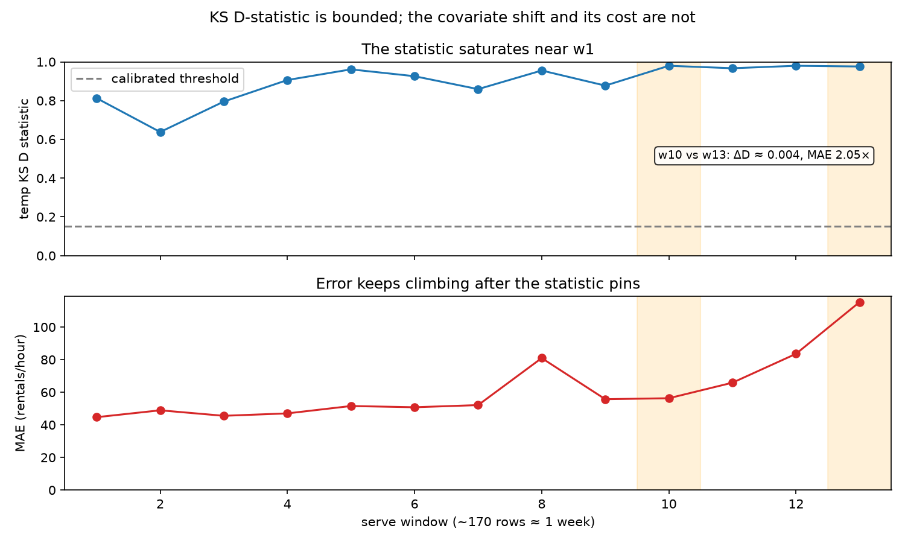
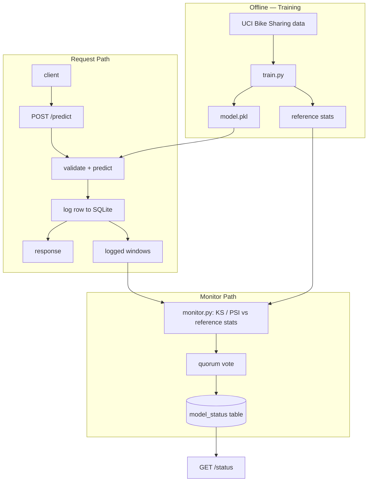

# ML Serving + Drift Monitoring on Real Seasonal Data

A FastAPI service serves hourly rental-count predictions from a simple regression model trained on UCI Bike Sharing data, logs every incoming feature row to SQLite; and a separate monitoring layer batches those rows into fixed-size windows and statistically tests them against the training distribution to flag drift. The model was trained on Jun–Oct 2011 and served against Oct–Dec 2011. The detector fires in window 1 at D = 0.81 (on a 0–1 scale) while MAE is still at its floor of 44.70, using inputs alone, twelve windows before MAE reaches 2.6× that value: a label-free leading indicator. The model is deliberately untuned; the engineering is the point: serving is structurally isolated from monitoring, and monitoring never touches a single request in isolation, because drift is a property of a sample, not a row. It also exposes a sharp limitation of the Kolmogorov–Smirnov (KS) D statistic as a severity measure: past a certain point it stops working as anything but a binary alarm.



## Results

Per-window measurements (rowid range → MAE, temp KS D, holiday PSI):
| Window | Rows | MAE (rentals/hr) | temp KS D | holiday PSI |
|---|---|---|---|---|
| 1 | 1–170 | 44.70 | 0.8126 | 0.0118 |
| 2 | 171–340 | 48.92 | 0.6379 | 0.2952 |
| 3 | 341–510 | 45.55 | 0.7949 | 0.0118 |
| 4 | 511–680 | 47.03 | 0.9062 | 0.0118 |
| 5 | 681–850 | 51.56 | 0.9612 | 0.0118 |
| 6 | 851–1020 | 50.79 | 0.9259 | 0.2952 |
| 7 | 1021–1190 | 52.12 | 0.8591 | 0.0118 |
| 8 | 1191–1360 | 80.97 | 0.9553 | 0.2952 |
| 9 | 1361–1530 | 55.73 | 0.8773 | 0.0118 |
| 10 | 1531–1700 | 56.33 | 0.9797 | 0.0118 |
| 11 | 1701–1870 | 65.87 | 0.9670 | 0.0118 |
| 12 | 1871–2040 | 83.58 | 0.9797 | 0.0118 |
| 13 | 2041–2203 | 115.34 | 0.9761 | 0.2956 |

Finding 1 — the alarm fired before the model degraded. Eyeballing train-vs-serve temp histograms early on suggested drift would be mild in early October and ramp up toward November/December. Measured KS D contradicts that: D is already 0.81 in window 1, dips as low as 0.64 in windows 2–3 while staying far above the calibrated threshold, then holds ≥0.86 from window 4 on. This isn't a units or scaling bug, confirmed with describe() on both distributions — it's structural: training only covers June–October, so the model never saw fall temperatures at all, and the shift is present the moment fall weather starts arriving. MAE, meanwhile, is still at its floor (44.70) in window 1 and doesn't reach 2.6× that value (115.34) until window 13, twelve windows later. The alarm fired at the first opportunity, using inputs alone, well before the label-based error signal would have caught it — and in production, where labels arrive late or never, that lead time is the entire value of the detector.

Finding 2 — KS D saturates, and it's the sharpest limitation the results surface. KS D is the maximum gap between two CDFs, capped at 1.0. Starting at 0.81 in window 1, D could grow at most ~23% over its window-1 value before hitting the ceiling — compare that to MAE, which grows +158% (44.70 → 115.34) over the same run. The clearest evidence is a single pair: window 10 (D = 0.9797, MAE = 56.33) vs. window 13 (D = 0.9761, MAE = 115.34) — near-identical (ΔD = 0.004) drift readings, double the error. The detector has no way to tell those two windows apart. KS D behaves as a binary alarm, not a severity gauge.

Finding 3 — holiday PSI is quantized because holiday is a binary feature: windows with no holiday-flagged rows floor at 0.0118 (epsilon-clamped), and windows that contain a holiday jump straight to ≈0.295, clearing the Population Stability Index (PSI) threshold of 0.2. Under the naive row-to-date mapping, the four windows that fire — w2, w6, w8, w13 — line up exactly with Columbus Day (Oct 10, w2), Veterans Day (Nov 11, w6), Thanksgiving (Nov 24, w8), and observed Christmas (Dec 26, w13). Window 8's fire coincides with the run's MAE spike (80.97, dropping back to 55.73 in w9) — a coincidence, not a demonstrated cause. The more useful pair is w2 and w6: both fire on holiday PSI with completely flat error, which is live evidence for the "coincidence is not causation" limitation below — two independent alarms by window 2, one of them consequence-free. Window 13 also coincides with Christmas, but its MAE (115.34, the run's highest) is confounded with the coldest temperatures in the serve window, so it isn't attributed to the holiday alone. [NEEDS YOUR INPUT — see note below: one-line status of the other four voting features, esp. whether weathersit fired anywhere.]

## Architecture
Serving and monitoring are deliberately decoupled. Serving is per-request and needs to stay low-latency; it does one job: validate, predict, log, respond. Monitoring needs a sample of rows to run KS/PSI against, which is meaningless computed on a single request, so it runs off the critical path, in batches, on its own schedule.



The model is loaded once at module scope so /predict never pays load cost per request. The detector module is split into two layers on purpose: a SQLite-aware loader that knows about rowids and windows, and pure statistical functions that take plain arrays and know nothing about the database. That split is what made the test harness possible without a database in the loop.

## Design decisions
Temporal split. Rejected: random train/test split. A random split would let the model see June and December rows in training, hiding exactly the seasonal shift this project exists to detect. Training on Jun 1–Oct 1 2011 and serving Oct 1–Dec 31 2011 forces the model to face weather it never saw, which is the realistic failure mode drift monitoring is meant to catch.

KS thresholded on the D statistic. Rejected: p-value threshold. With n in the hundreds per window, KS p-values go significant on trivial, practically meaningless differences. Thresholding on D directly keeps the alarm tied to effect size instead of sample size. [NEEDS YOUR INPUT — see note below: state the KS D threshold value here, next to PSI's 0.2.]

season and mnth excluded from the drift quorum vote. Rejected: voting on every feature. The temporal split guarantees these two differ between train and serve by construction, so every window would trivially flag on them regardless of anything else happening in the data. They're still computed and logged, just not allowed to cast a vote, so the vote reflects features that could plausibly not have drifted.

Single-feature quorum triggers a flag, not majority vote. Rejected: majority-vote status (e.g., require most of the voting features to cross before alerting). Per-feature KS/PSI thresholds are calibrated against the null distribution, so a single crossing is already a low-false-positive event; majority voting would let a real, isolated shift hide behind several calm features. Persist-until-cleared already routes any alarm — false or real — to a human for review, so quorum-of-one doesn't need a voting layer to protect against noise.

Fixed-row-count windows by rowid, not fixed time buckets. Rejected: calendar-day or wall-clock windows. Wall-clock timestamps from the replay are all nearly identical since replay isn't real-time, so time-based windows would be meaningless; a fixed row count also keeps n — and therefore test power — comparable across windows, and rowid order already matches true 2011 chronology, so nothing is lost by dropping timestamps.

Status is persist-until-cleared, no auto-recovery. Rejected: status that clears itself once a clean window is seen. Auto-recovery would let a single quiet window mask an underlying shift that's still there. Requiring an explicit clear keeps a human in the loop for the decision that the model is trustworthy again.

## Limitations
KS D saturates and stops being informative once drift is severe — the fix is a different statistic, not more labels. Swap the bounded KS D for an unbounded distance such as Wasserstein (Earth Mover's) distance, which keeps growing as the two distributions pull further apart, and should grade window 10 against window 13 where KS D reads them as identical. Monitoring error once labels arrive remains a useful secondary check, but it's exactly the signal this detector exists to substitute for while labels are late or absent, so it's a mitigation, not the fix. This project also tests each feature independently and votes across the results; a textbook next step for multivariate drift is testing the full feature vector jointly — e.g., a domain-classifier or MMD-based two-sample test — rather than voting across marginals.

Coincidence is not causation. Drift coinciding with rising error in this project is a property of this setup: a model trained only on warm months facing genuinely out-of-distribution cold-weather inputs, not a general property of covariate shift. A model that generalized well to the shifted region could see drift fire with error holding flat. Nothing here measures or demonstrates a causal link between the two.

Drift detection is a leading indicator, not a replacement for ground-truth monitoring. Once labels become available, they remain the more reliable signal for model quality; input-distribution tests exist to cover the gap before labels arrive, not to substitute for them indefinitely.

## Running it

```bash
# 1. Environment (Python 3.12 — 3.14 breaks scipy's _highspy)
python3.12 -m venv venv          # Windows: py -3.12 -m venv venv
source venv/bin/activate         # Windows: venv\Scripts\activate
pip install -r requirements.txt

# 2. Train the model on the Jun 1 – Oct 1 2011 slice
python train.py

# 3. Start the serving API (model loaded once at startup)
uvicorn serve:app --reload

# 4. In a separate process, replay the Oct 1 – Dec 31 2011 rows
#    chronologically against the running API
python replay.py

# 5. Run the monitor over the logged windows
python monitor.py

# 6. Check current status
curl http://127.0.0.1:8000/status
```